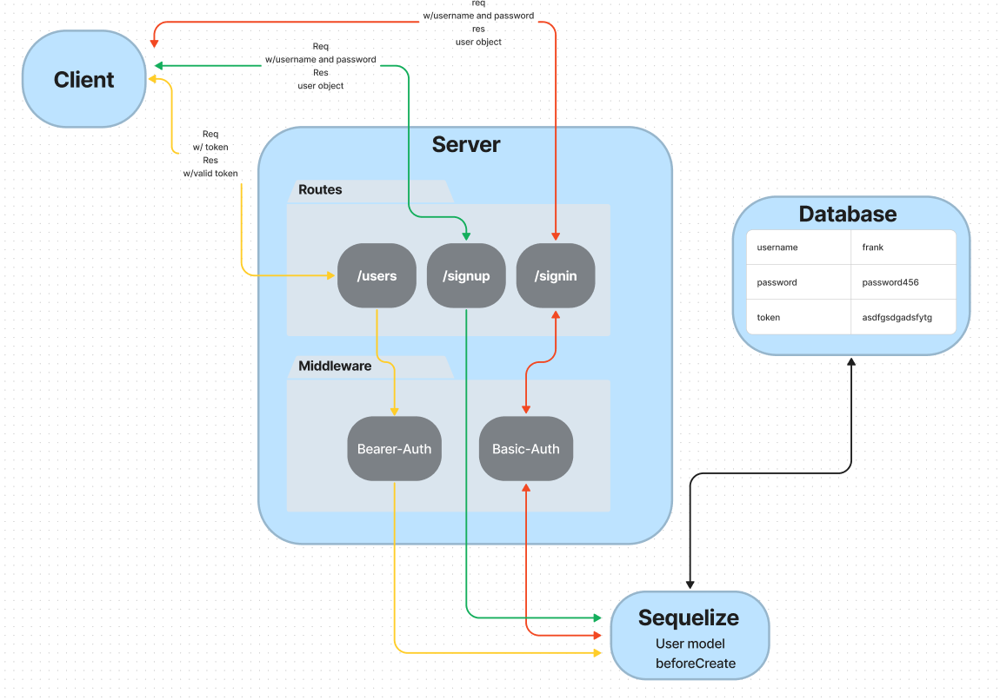

# bearer-auth

401d53 Lab 7 bearer auth

## Project: Bearer-Auth

### Author: Justin Mathieu

## Problem Domain

Practice with basic auth and bearer auth.

## Links and Resources

[GitHub Actions]()
[back-end prod url](https://bearer-auth-yflz.onrender.com)

## Collaborators

401d53 and 401d10 Used demo code as permitted.

## Setup

- Port variable
- Connection string for database.
- Secret for JWT.

## How to initialize/run your application (where applicable)

- Clone repo
- Run npm i in terminal
- Run nodemon in terminal

## Routes

POST: /signin - Authenicates user with password.(Basic auth)
POST: /signup - Creates user in database.
GET: /users   - If valid JWT token gets all users.(Bearer auth)
GET: /secret  - Validates jwt to access secret area.(Bearer auth)

## Tests

- Run the command npm test with dependencies installed.

## UML

